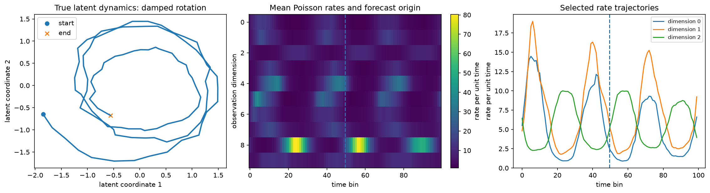
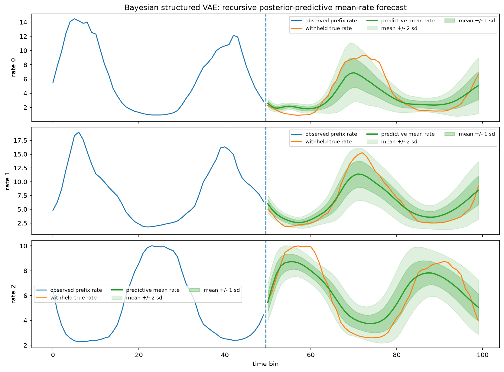
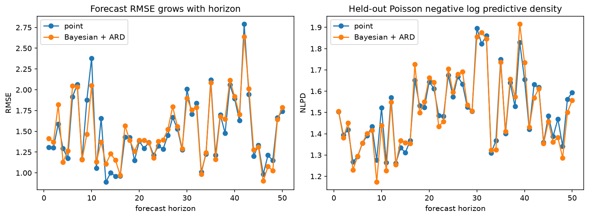
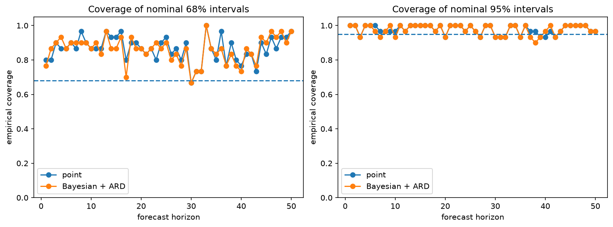
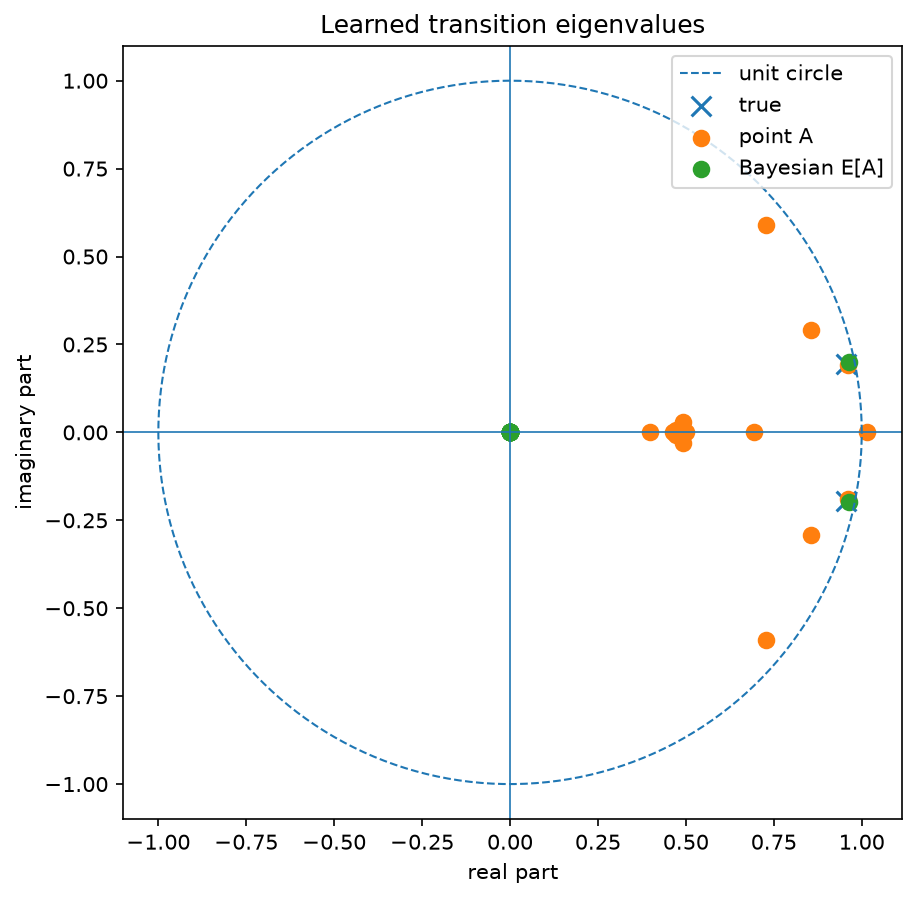
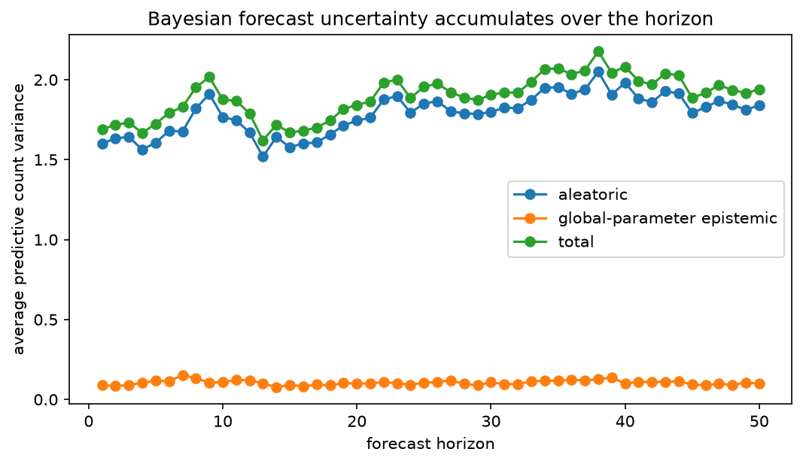

# Structured VAEs

`Forecasting/` is where I implement different flavours of Structured VAE to forecast neural spikes driven by underlying dynamics. `Practice/` is a lightweight implentation where I simply try to recover the latent dynamics

Please look to the notebooks for more information. 

## Forecasting Experiments

### DGP

### Forecast

### Metrics

### Calibration

### Dynamics

### Uncertainty

